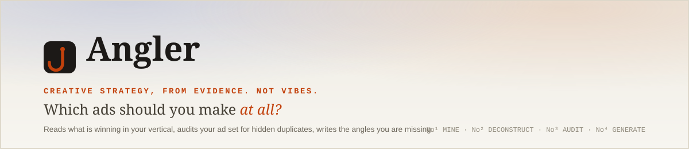
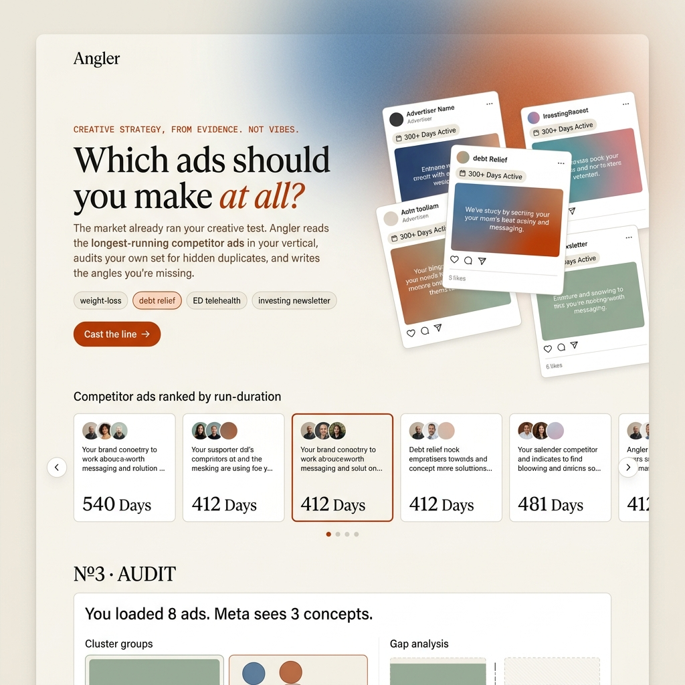

<p align="center">
  
</p>

<p align="center">
  
  
  
  
  
  <a href="https://github.com/parthiv-2006/Angler/actions/workflows/ci.yml"></a>
</p>

<h3 align="center">🎣 Live demo: <a href="https://www.angler.software"><b>angler.software</b></a></h3>
<p align="center"><i>No login. No credentials. Works in an incognito window, first click.</i></p>

<p align="center">
  
</p>

---

## What does it do?

Angler is a four-module AI tool for affiliate media buyers that answers the question most teams never ask systematically: **which ads should we make at all?**

Pick one of four pre-analyzed verticals (weight-loss supplement, debt relief, ED telehealth, investing newsletter) and watch all four modules run in about fifteen seconds:

| # | Module | What it does |
|---|--------|--------------|
| **01** | **Mine** | Pulls the top competitor ads for that vertical from the Meta Ad Library, ranked by run-duration. An ad that survives 30+ days of real spend is a winner. Longevity is a free, public proxy for ROI. |
| **02** | **Deconstruct** | A vision + language model turns each winning ad into a structured record: hook type, emotional driver, format, offer framing, CTA style, target persona. A gallery of ads becomes a queryable creative database. |
| **03** | **Audit** | Load one of the four bundled ad sets and Angler groups it into the distinct *concepts* Meta's algorithm actually sees. You think you're running 8 ads. Meta sees 3. The audit shows exactly where auction entries are being wasted and estimates the monthly dollar cost, and a pre-flight check tells you whether a planned ad would earn its own entity or fold into one you already run. |
| **04** | **Generate** | Synthesizes the market patterns from Mine with the gaps from Audit into 10+ prioritized angle briefs, each with platform-formatted copy for Meta, TikTok, and native. Ready to paste into a bulk sheet or hand to a video tool. |

Everything on screen is real. The demo is deliberately locked to four seeded verticals and their bundled sample ad sets, not a free-text box, so that every judge click loads instantly from cache instead of racing a live scrape or a live model call on submission night. See [Data provenance](#data-provenance-no-fabricated-data) for exactly what that trade means.

Two things layered on top: a **share link** for any seeded run (`?v=&s=` in the URL replays the exact demo), and an **MCP server** so the whole intelligence layer is callable from Claude Desktop or Claude Code (see [Use it from Claude](#use-it-from-claude-mcp)).

---

## Why did you build this one?

Three reasons, in order of leverage.

### 1. Creative is now the dominant performance lever, and most teams don't know it yet

Meta's Andromeda retrieval system, which finished rolling out around October 2025, changed how ads get delivered. Instead of routing by advertiser-defined audiences, it uses computer vision to read the creative itself and predict who should see it. Your creative *is* your targeting now. Meta's own data attributes roughly 56% of campaign performance to creative quality, ahead of targeting, budget, placement, and timing combined. Top-third advertisers run around 395 live ads at once versus 296 for the bottom third, and the going cadence is 8 to 12 genuinely distinct concepts per campaign, refreshed every 2 to 3 weeks. Creative volume and real diversity are existential now, not a nice-to-have.

### 2. The Entity ID trap is a specific, money-losing problem almost nobody checks

Andromeda assigns every creative an Entity ID based on its visual and semantic pattern. Upload ads that are too similar and they collapse into the same ID: you think you're running 10 diverse ads, Meta enters 3 into the auction, and the other 7 are wasted spend every day they run. Most teams optimize for cosmetic diversity (new headline, same hook, same format) without realizing it adds no real signal. Module 3 measures *semantic* diversity, the thing that actually matters to the algorithm, and names the gaps in terms of angles that are already proven in the market.

### 3. For a direct-response affiliate shop, the angle is the highest-ROI lever, and this is the missing stage in the assembly line you're already building

A reporting dashboard describes the past. An angle engine creates future winners. It's Today Media is already building a video creative generator to *make* ads and an MCP uploader to *launch* them. Neither one decides *what* to make. Angler is the upstream strategy layer that feeds both: angle briefs are written to drop straight into the video tool, and the resulting ads flow into the MCP uploader. Not a competing tool, but the first stage of a pipeline that makes the other stages worth running.

---

## What would you build next?

In the order I'd actually sequence it for a lean affiliate team.

**1. Turn the live path back on, safely.** The scraping and AI pipeline for novel verticals already exists end to end in the codebase (`lib/sources`, `lib/ai`, `app/api/mine`), and it worked before it was intentionally disabled in the UI for submission night so the demo can never race a live scrape or a rate-limited model call. Next step: put it behind a clearly labeled "run this live" toggle, with the seed path as the default and the fallback the judge always lands on if the live call is slow or fails.

**2. Close the performance feedback loop.** Wire the angle briefs to actual CPA and ROAS outcomes. After a campaign runs, tag which generated angles converted and at what cost, so the tool learns which creative patterns win in this specific vertical, for this specific audience. The strategy layer stops sourcing only from the open market and starts learning from the team's own results.

**3. Widen the data and sharpen the score.** Layer embeddings-based cosine similarity alongside the explained clusters, so a team gets a concrete diversity number per ad set instead of only a narrative. Add a paid Apify tier for deeper coverage (roughly $0.40 per 1,000 ads via ScrapeCreators) and Meta Ad Library access for first-party brand data, plus a live TikTok Creative Center connection once its anonymous-access token issue clears up. The free-tier demo is a sample. Production should be the full picture.

---

## Data provenance (no fabricated data)

Everything the demo shows is real.

- **Seed verticals** (weight-loss supplement, debt relief, ED telehealth, investing newsletter) are real, currently or recently running ads pulled from the **Meta Ad Library**, scraped via the public Apify actor [`curious_coder/facebook-ads-library-scraper`](https://apify.com/curious_coder/facebook-ads-library-scraper) and cached so the demo runs instantly with zero credentials. Every ad's run-duration comes from its real Ad Library delivery start date, and advertiser names are real entities you can look up yourself in the [Meta Ad Library](https://www.facebook.com/ads/library/). Refresh the cache anytime with `npm run refresh-seed`.
- **Sample ad sets** used in the Audit step are bundled per vertical (`data/seed/samples/*.json`), built from the same real ad data, deliberately assembled to include a few near-duplicate concepts so the collapse detection has something real to find.
- **The demo UI only exposes the seeded path.** A free-text vertical box and a paste-your-own-copy flow for the Audit step existed earlier in the build and both worked, calling a live Apify pull and a live Claude/Gemini call respectively. Both were pulled from the UI on submission day so the judge's click can never hit a slow scrape, a rate limit, or a cold API key. That live plumbing is still in the codebase (see [What's next](#what-would-you-build-next)); it's turned off in the interface on purpose, not missing.
- **TikTok Creative Center** is wired as a documented integration in `lib/sources/tiktok-creative-center.ts`, but its public endpoint now requires a signed anonymous-user token and returns a 401 for anonymous traffic, so it isn't part of the zero-credential demo path today.

**Data limits:** public scrapers return samples of top performers, roughly 20 to 50 ads per run, not exhaustive datasets. That's intentional. The job here is analyzing what's winning, not cataloguing every ad. A production deployment would run on Apify's paid plan or ScrapeCreators (about $0.40 per 1,000 ads); because results are cached per vertical, steady-state scraping cost stays near zero.

## Cost & limits

**AI cost:** seed verticals are pre-analyzed and served from cache, so clicking through the demo makes zero API calls. A full live run on a novel vertical (15 ads through DNA extraction, clustering, and 10 generated briefs) costs roughly $0.03 to $0.05 at Anthropic's Sonnet pricing. Gemini Flash is a one-env-var fallback at effectively $0 on the free tier.

**Stack:** Next.js 15 App Router, TypeScript (strict mode), Supabase, Anthropic API (Claude Sonnet), deployed on Vercel. Mirrors It's Today Media's own frontend stack.

---

## Use it from Claude (MCP)

The deployed app doubles as an **MCP server** at `/api/mcp`. Add it to Claude Code, Claude Desktop, or any MCP client that supports streamable HTTP:

```json
{
  "mcpServers": {
    "angler": {
      "url": "https://www.angler.software/api/mcp"
    }
  }
}
```

Five tools are exposed: `list_verticals`, `get_market_winners`, `get_market_dna`, `get_diversity_report`, and `get_angle_briefs`. Then ask Claude things like:

- *"What angles should I test for debt relief?"*
- *"Which ads in the weight-loss sample set collapse into the same concept, and what's missing?"*
- *"Show me the creative DNA of the longest-running ED telehealth ads."*

The MCP tools serve the pre-analyzed seed verticals only: instant, zero credentials, zero AI spend. For local development, point the client at `http://localhost:3000/api/mcp` instead.

---

## Running locally

```bash
npm install
cp .env.local.example .env.local   # optional: add ANTHROPIC_API_KEY + Supabase keys
npm run dev
```

The seed path (4 pre-analyzed verticals + 4 bundled sample ad sets) works with **no API keys at all**. Live scraping and live model calls exist behind route handlers in `app/api/*` for local testing, gated by `ANTHROPIC_API_KEY` and `APIFY_TOKEN`, but they are not reachable from the shipped UI (see [Data provenance](#data-provenance-no-fabricated-data)).

```bash
npm run typecheck   # tsc --noEmit
npm run test        # unit tests
npm run build        # must pass before deploy
```

---

<p align="center"><sub>Built for the It's Today Media $5,000 Build Challenge · July 2026</sub></p>
